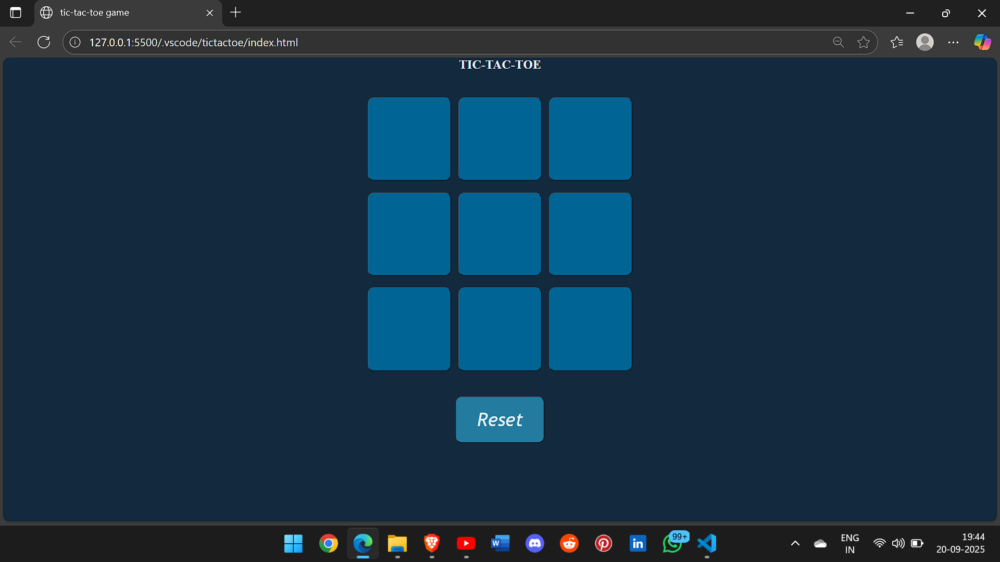
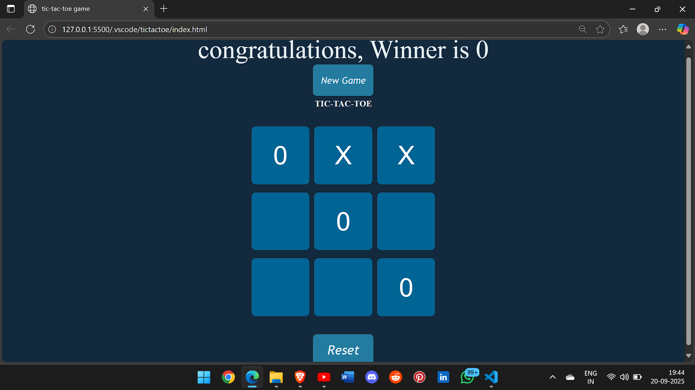

# Tic Tac Toe Game

## Overview
A two-player browser game built with HTML, CSS, and JavaScript. Players take turns placing X and O on a 3x3 grid. The game detects winners, draws, and includes a reset option.

## Features
- Two-player mode
- Win & draw detection
- Reset game anytime
- Simple UI

## How to Play
1. Open `index.html` in a browser.
2. Click an empty cell to place X or O.
3. The game alternates turns automatically.
4. Winner or draw is displayed automatically.
5. Click "Reset" to start a new game.

## Live Demo
Play online: [https://heyichcha.github.io/tic-tac-toe/](https://heyichcha.github.io/tic-tac-toe/)

## Technologies
- HTML
- CSS
- JavaScript

